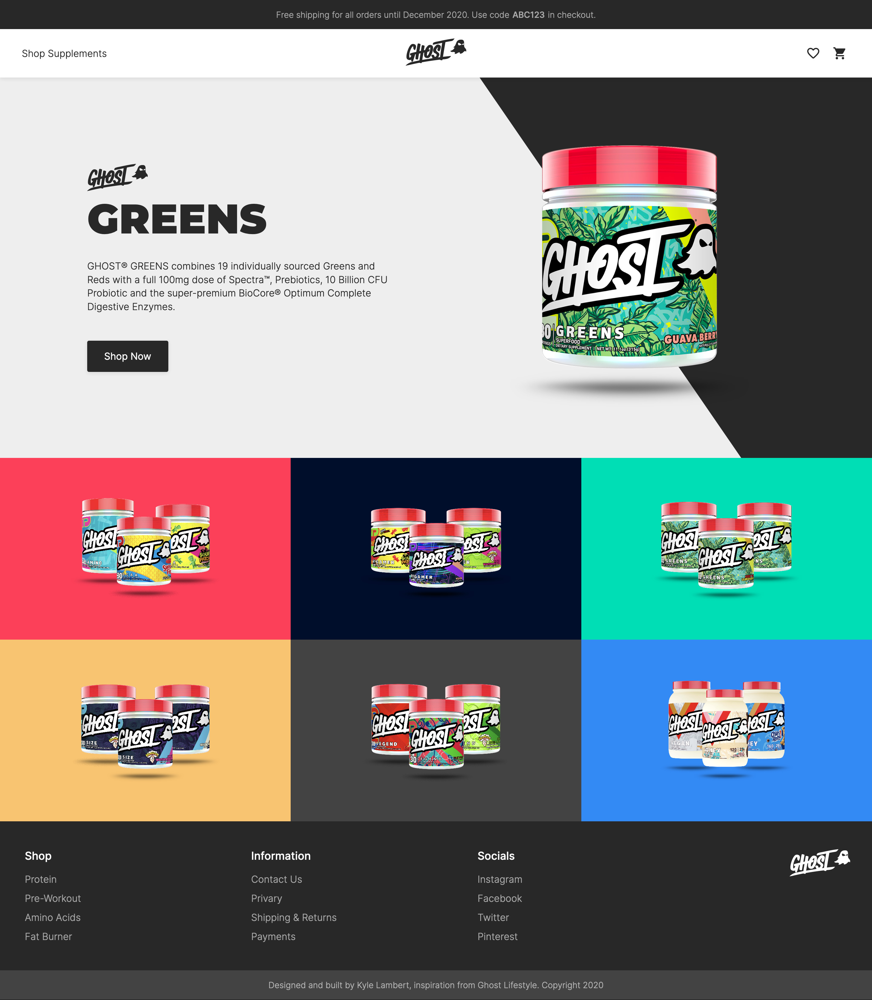
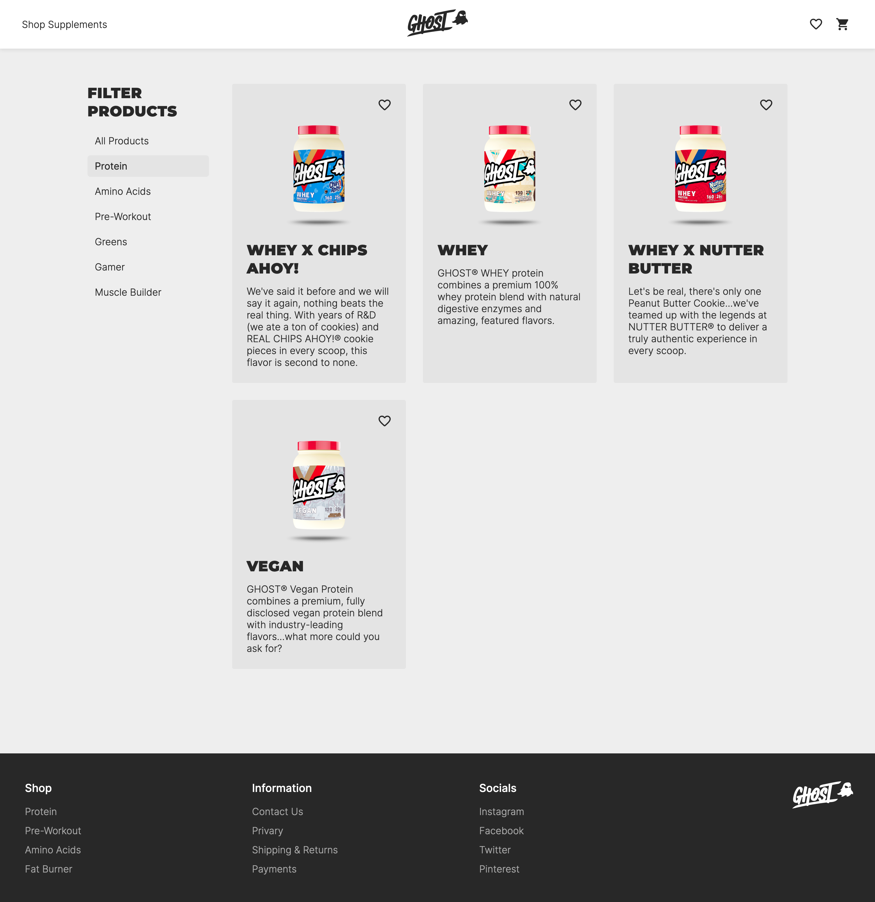
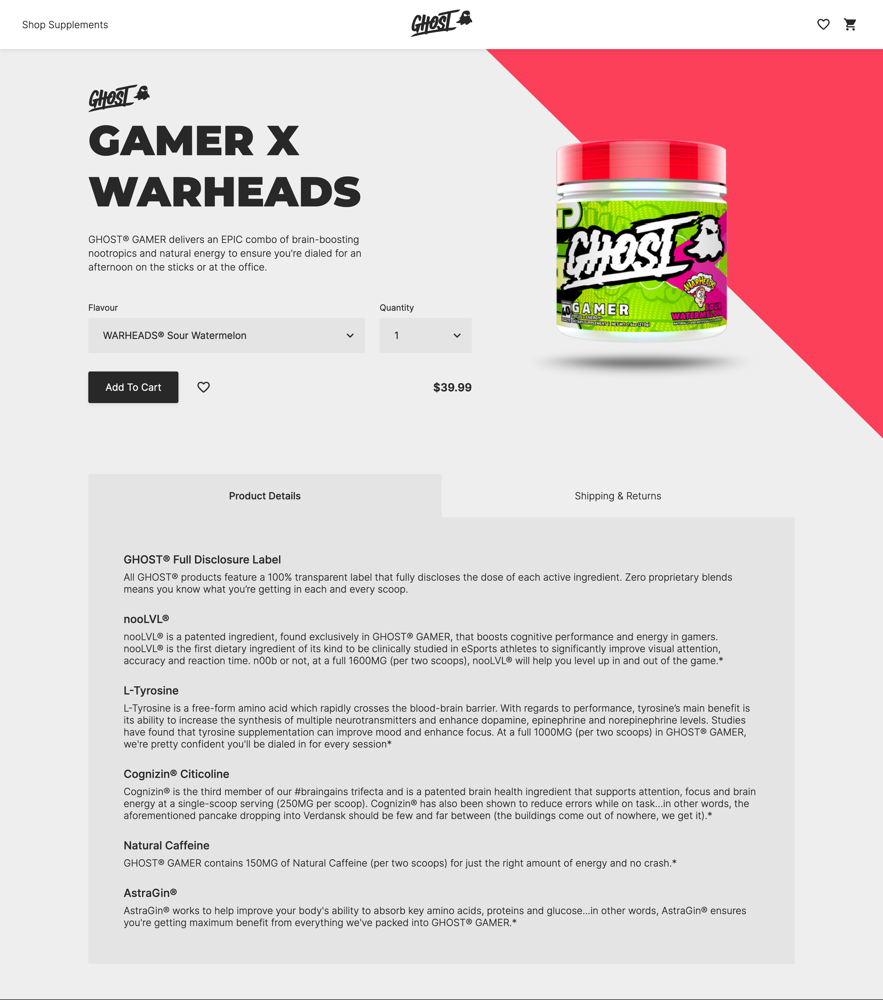

# ghost-lifestyle-ecommerce

## Introduction

This website is a working progess and was based off the popular supplement brand [Ghost Lifestyle Supplements](https://www.ghostlifestyle.com/). This website was built for educational purposes only and is not intended to used for production in any way. This website integrates with Stripe payments **TEST** API which showcases expected payment functionality without ever exchanging fiat currency.

Visit live website - [Ghost Lifestyle Ecommerce](https://musing-lichterman-efc7d0.netlify.app/)

### Technologies

This website was built with the following technologies:

- [React](https://reactjs.org/) - Framework
- [React Context API](https://reactjs.org/docs/context.html) - State Management
- [Styled Components](https://styled-components.com/) - Locally Scoped Styles
- [Framer Motion](https://www.framer.com/motion/) - Animation Library
- [Stripe Payment API](https://stripe.com/docs) - Test Payment API
- [Strapi CMS](https://strapi.io/) - Content Management System
- [Amazon S3](https://aws.amazon.com/s3/) - Cloud Storage

### Goals

- To build a website which would be a great addition to my porfolio, thus showcasing my skills and knowledge as a Web Developer.
- To step outside my comfort zone and aquire new skills required to build an ecommerce website.
- Deliver a modern and responsive design for great User Experience.
- Gain knowledge and understanding of frontend/backend deployment services.

### Challenges

During the build of this website I faced some minor setbacks but nothing I unable to overcome. When encountering problems I didn't just seek a quick solution and move on but rather I wanted to fully understand what caused it and how to avoid it for future reference. I think being able to adapt to different situations and learn on the fly is a valuable skill to have, especially in Software Engineering where Technologies are always changing.

I've learnt and gained experience in:

- React Hooks: How they work compared to traditional class based components and the appropriate use cases for each hook.
- Caveats to using newer features of React, understanding `useEffect` dependency array, clean-up functions and when to use complex hooks such as `useCallback` and `useMemo`.
- React Context API and how to efficiently manage global state using `useReducer`.
- Building React components in a loosly coupled and reusable manner.
- Abstracting repeated logic into custom hooks.
- Database modeling and collections with Strapi CMS.
- Intergrations with Stripe Payment API.
- Handling cloud storage uploads with Amazon S3.
- Server/database deployment and configuration using Heroku premium dynos.

### Screenshots

